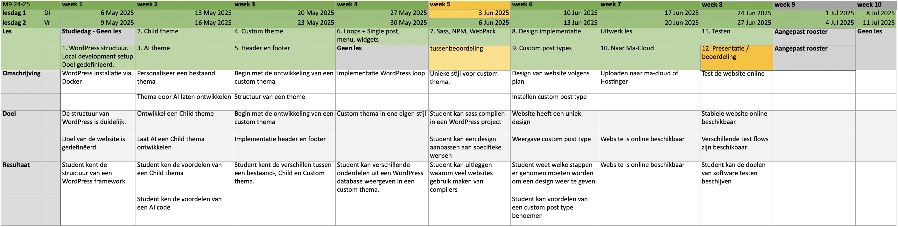

# WordPress - {{ page.title }}

Op deze website vind je de opdrachten voor de unit M8PROG waarbij wij een custom thema voor WordPress gaan ontwikkelen.

---

## Planning
Hier kun je de planning van deze periode vinden.

Download de PDF versie van de planning:
[Planning_M8.pdf](Planning_M8.pdf)
---

## Opdrachten en uitleg


{% assign today = "now"|date:"%Y%m%d" %}
{% assign lesson_date = lesson.datum|date:"%Y%m%d" %}


## Les {{ lesson.number }}:  {{ lesson.title }}
{: .text-blue-100 :}

{{ lesson.description }}

[Start](les-{{ lesson.number }} ){: .btn .btn-blue }

## Les {{ lesson.number }}:  {{ lesson.title }}
{: .text-grey-dk-000 :}

Deze les komt binnenkort online. 
<small>Vanaf {{ lesson.datum|date:"%d-%m-%Y" }} online </small>

---


