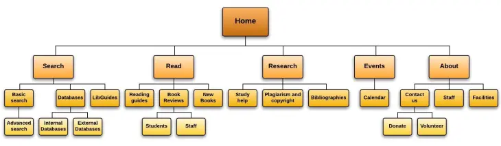

## Flowchart maken (stroomdiagram)
{: .text-green-100 .fs-6 }

Voor je kunt beginnen aan het echte coderen moet je weten WAT je gaat coderen en welke pagina's je website bevat.

Hiervoor maak je een stroomdiagram of flowchart. Er zijn veel online tools die gratis te gebruiken zijn.
Zoals [Lucidcharts](https://www.lucidchart.com/pages/nl/voorbeelden/stroomdiagram-maken){: target="_blank"}. Je mag ook een andere tool gebruiken die je fijner vindt werken.

Een flowchart bevat een overzicht van de pagina's en onderdelen op je website. Meestal begint deze vanaf de homepage waarvandaan aftakkingen worden gemaakt naar alle pagina's en subpagina's.

---

Zo zou dat er uit kunnen zien:

Je kunt ook voor bepaalde user stories een aparte flowchart maken waar je de losse stappen en aftakkingen in beeld brengt.
Door het te visualiseren krijg je een goed beeld van de logische stappen en beslissingen die je moet nemen. 
Als dat duidelijk is kun je de afzonderlijke pagina's en stappen gaan vormgeven en coderen.

[Hier staat meer uitleg en voorbeelden](https://mockitt.wondershare.com/flowchart/website-flowchart.html)

---

Maak de flowchart voor jouw website en zet de flowchart in een makkelijk leesbaar formaat (PDF, JPG) in je repository.
Zet een link in je `website.md` markdown document naar de flowchart of embed de flowchart in je markdown document.
{: .text-blue-100 .fs-5 }



